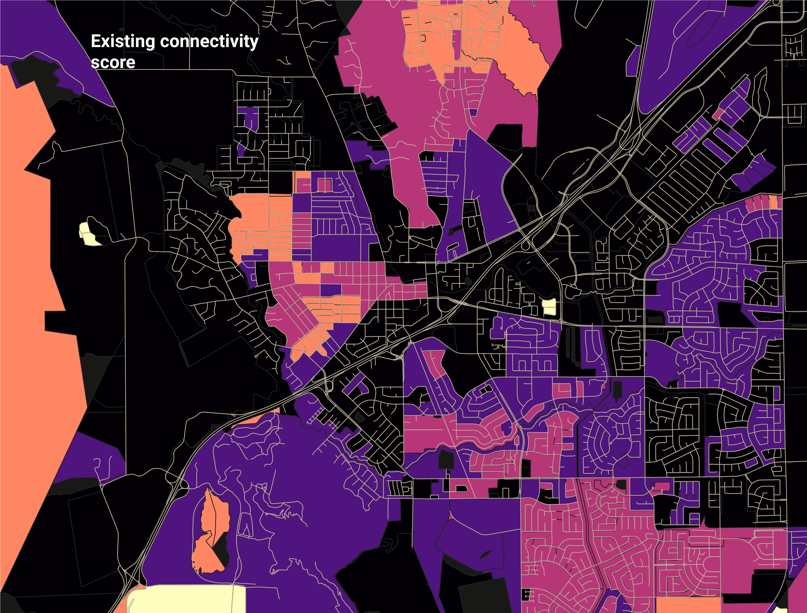

# pyBNA

## Introduction

Python module to implement BNA logic on a PostGIS database. Uses a configuration
file for customizability. The current implementation requires a user to run the
old-style BNA on the command line to import datasets. This library can build the
routeable network, process the connectivity routing, and calculate scores.

Bicycle Network Analysis (BNA) is a way to measure how effectively people
can connect to destinations via bike on comfortable, "low-stress" routes.
More info on the methodology at the [What is the BNA?](what_is_bna.md) page.



## Requirements

pyBNA is tested with Python 2.7. The following libraries are required:
- psycopg2
- tqdm
- pyyaml
- geopandas
- munch
- overpass
- omsnx (version 0.9 until Python 3 is supported)

You can install these via pip:
```
pip install psycopg2 tqdm pyyaml geopandas munch overpass osmnx==0.9
```

_*Special note for Windows users:_ Installing geopandas can be a real pain. If
you don't already have a working version of Geopandas, we suggest following
[this excellent guide](https://geoffboeing.com/2014/09/using-geopandas-windows/)
from Geoff Boeing.

The `osmium` package is also required for parsing OSM destinations from an .osm
extract, but if you're downloading destinations directly from OSM you can
safely skip this dependency.

_A note on moving to Python 3_

_We are aware that Python 2 will be deprecated soon in favor of Python 3. Our
intention is to make this change in pyBNA in the near future. We do not expect
the switch to disrupt the pyBNA API in any way so this change should not be
overly disruptive for most users, apart from having to run pyBNA with the latest
Python 3 version._

## tl;dr (Simple run)

The most simple BNA run, using stock datasets and no customization, can be
completed in a few easy steps. The following assumes you already have a database
running named "bna" on the local machine.

```
import pybna

# imports
i = pybna.Importer()
i.import_boundary('/path/to/your/boundary/file')
i.import_census_blocks(fips=16)
i.import_census_jobs("received.neighborhood_census_block_jobs",state="ID")
i.import_osm_network()
i.import_osm_destinations()

# stress
s = pybna.Stress()
s.segment_stress()
s.crossing_stress()

# connectivity
bna = pybna.pyBNA()
bna.calculate_connectivity()
bna.score_destinations("myschema.mytable")
```

## Importing data

pyBNA includes a workflow to import data from publicly available sources (for
the United States, at least). Automatic import of demographic data relies on US
Census 2010 data. Street network and bicycle facility data is imported from
OpenStreetMap.

For more guidance on the import process, see our [import instructions](import.md).

## Getting started

First, import pybna and create a pyBNA object by pointing it to the config file.
```
import pybna
bna = pybna.pyBNA(config="/home/spencer/dev/napa/bna/bna_vine_config.yaml")
```

Next, you can calculate the connectivity with
```
bna.calculate_connectivity()
```

Lastly, you can generate block-level scores with
```
b.score_destinations("my_results_table")
```

## Configuration file

Most options in pyBNA are managed using a configuration file. This file is
passed as an argument when creating the pyBNA object and tells pyBNA important
things about your data and the assumptions you want to make in the analysis. The configuration file is written using [YAML](http://yaml.org/start.html).

There's more information about the configuration file [here](config.md)

## Travel sheds

Once you've completed the connectivity analysis, you can develop a low/high stress travel shed for any census block with
```
bna.travel_sheds([list, of, block, ids, here], my_travel_shed_table)
```
